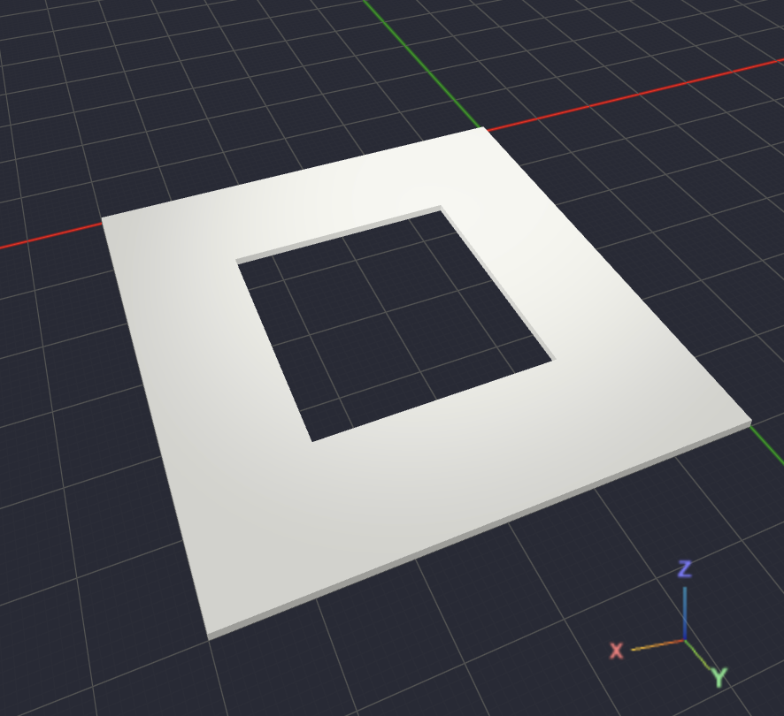

## Modelagem 2D

A modelagem 2D é uma etapa importante. No OpenScad práticamente todo sólido 3D começa de um desenho 2D

Como nos exemplos:

```
circle()
        ↓
linear_extrude()
        ↓
Cilindro

---

polygon()
        ↓
linear_extrude()
        ↓
Peça 3D

---

text()
        ↓
linear_extrude()
        ↓
Texto em relevo
```

### Objetos 2D

No OpenScad temos os seguintes objetos 2D

| Comando     | O que cria            |
| ----------- | --------------------- |
| `square()`  | Retângulo ou quadrado |
| `circle()`  | Círculo               |
| `polygon()` | Qualquer polígono     |
| `text()`    | Texto                 |
| `import()`  | Importa SVG           |

### Square

Equivale ao 2D do cubo, ou seja, um quadrado

```
square(size=20);
```

parâmetros:

| parametro | descrição                                                       | aplicação                                                                              |
| --------- | --------------------------------------------------------------- | -------------------------------------------------------------------------------------- |
| `size`    | Define o tamanho do quadrado ou retângulo.                      | `square(20)` cria um quadrado de 20×20. `square([30, 10])` cria um retângulo de 30×10. |
| `center`  | Define se a forma fica centralizada na origem. Padrão: `false`. | `square(20, center=true)` centraliza o quadrado no eixo X e Y.                         |

### Circle

É um circulo comum

```
circle(r=20);
```

parâmetros:

| parametro | descrição                                               | aplicação                                            |
| --------- | ------------------------------------------------------- | ---------------------------------------------------- |
| `r`       | Define o raio do círculo.                               | `circle(r=20)` cria um círculo com raio de 20 mm.    |
| `d`       | Define o diâmetro do círculo. Alternativa ao `r`.       | `circle(d=40)` equivale a `circle(r=20)`.            |
| `$fn`     | Número de segmentos usados para desenhar o círculo.     | `circle(r=20, $fn=100)` deixa o círculo mais suave.  |
| `$fa`     | Ângulo mínimo de cada segmento, em graus. Padrão: `12`. | Valores menores aumentam a suavidade da curva.       |
| `$fs`     | Tamanho mínimo de cada segmento, em mm. Padrão: `2`.    | Útil para controlar a qualidade em círculos grandes. |

### Polygon

Esse é um dos comandos mais inportantes da modelagem 2D. Ele permite desenhar qualquer forma.

Ele funciona por meios de pontos, onde informamos as coordenadas de dada ponto para que ele seja aplciado.

```scad
linear_extrude(height=1)
    polygon(
        points=[
            [0,0],
            [20,0],
            [20,20],
            [0,20],
            [10,10],
        ]
    );
```

No modelo acima temos o pologono de uma bandeirola de São João.

O linear_extrude foi utilizado para utilizado para far uma altura ao polygono, de modo que seja possivel vizualizar a peça.

parâmetros:

| parametro   | descrição                                                                      | aplicação                                                       |
| ----------- | ------------------------------------------------------------------------------ | --------------------------------------------------------------- |
| `points`    | Lista de coordenadas `[x, y]` de cada vértice da forma.                        | `points=[[0,0], [20,0], [20,20]]` define um triângulo reto.     |
| `paths`     | Define a ordem em que os pontos se conectam, usando índices da lista `points`. | `paths=[[0,1,2,3]]` conecta os 4 primeiros pontos em sequência. |
| `convexity` | Ajuda o OpenSCAD a renderizar polígonos côncavos. Padrão: `1`.                 | Em formas com recortes, como a bandeirola, use `convexity=10`.  |

Com o Polygon é possivel criar contornos internos e externos como no código a baixo

```scad
points = [
    // Contorno externo
    [0,0],     //0
    [60,0],    //1
    [60,60],   //2
    [0,60],    //3

    // Contorno interno
    [15,15],   //4
    [45,15],   //5
    [45,45],   //6
    [15,45]    //7
];
linear_extrude(height=1)
    polygon(
        points=points,
        paths = [
        [0,1,2,3],    // contorno externo
        [7,6,5,4]     // contorno interno (invertido)
    ]
);
```

o resultado é mostrado na imagem a baixo:

<p align="center">
  
</p>

### Text

O comando Text cria um texto em 2d

```scad
text("OpenSCAD");
```

parâmetros:

| parametro   | descrição                                                              | aplicação                                                               |
| ----------- | ---------------------------------------------------------------------- | ----------------------------------------------------------------------- |
| `text`      | String com o conteúdo a ser exibido.                                   | `text("OpenSCAD")` escreve o texto informado.                           |
| `size`      | Tamanho da fonte, em mm. Padrão: `1`.                                  | `text("OpenSCAD", size=10)` aumenta o texto.                            |
| `font`      | Nome da fonte instalada no sistema. Padrão: `"Liberation Sans"`.       | `text("OpenSCAD", font="Arial")` troca a fonte.                         |
| `halign`    | Alinhamento horizontal: `"left"`, `"center"` ou `"right"`.             | `text("OpenSCAD", halign="center")` centraliza no eixo X.               |
| `valign`    | Alinhamento vertical: `"top"`, `"center"`, `"baseline"` ou `"bottom"`. | `text("OpenSCAD", valign="center")` centraliza no eixo Y.               |
| `spacing`   | Espaçamento entre os caracteres. Padrão: `1`.                          | `text("OpenSCAD", spacing=1.2)` afasta as letras.                       |
| `direction` | Direção do texto: `"ltr"` ou `"rtl"`. Padrão: `"ltr"`.                 | `text("OpenSCAD", direction="rtl")` escreve da direita para a esquerda. |
| `language`  | Idioma do texto para renderização correta. Padrão: `"en"`.             | `text("Olá", language="pt")` ajuda na exibição de acentos.              |
| `script`    | Tipo de escrita: `"latin"` ou `"unicode"`. Padrão: `"latin"`.          | Use `"unicode"` para caracteres especiais ou símbolos.                  |

### Offset

Esse comando é fantástico. Ele aumenta ou diminui um contorno.

```scad
offset(2)

square(20);
```

É muito usado para

- Paredes
- Folgas
- Encaixes
- Molduras
- Compensação de impressão

parâmetros:

| parametro | descrição                                                                              | aplicação                                                                |
| --------- | -------------------------------------------------------------------------------------- | ------------------------------------------------------------------------ |
| `r`       | Distância do offset com cantos arredondados. Valor positivo expande; negativo encolhe. | `offset(2)` ou `offset(r=2)` aumenta o contorno com bordas arredondadas. |
| `delta`   | Distância fixa do contorno original, mantendo cantos angulares.                        | `offset(delta=2)` expande o quadrado com cantos retos.                   |
| `chamfer` | Recorta os cantos em linha reta quando usa `delta`. Padrão: `false`.                   | `offset(delta=2, chamfer=true)` evita pontas longas nos cantos.          |

### Import

O import ja foi mencionado em [Comandos e variaveis](./docs/basic/commands.md), onde explique que o import permite importar arquivos svg e stl
