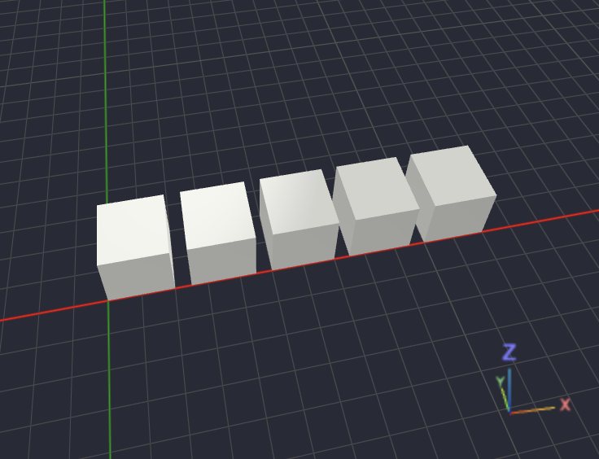
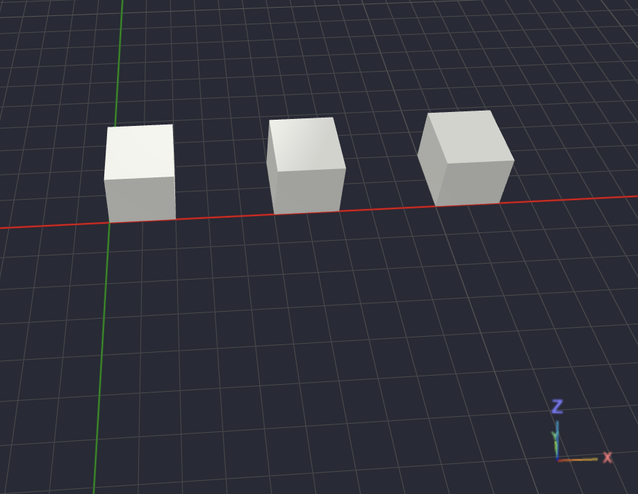

## Comandos da linguagem de programação

O OpenScad é uma linguagem de programação delcarativa e funcional. Nela é descrito o modelo e não a sequência de instruções.

### Comentários

Linha única:

```scad
// Meu comentário
cube(10);
```

Muitas linhas:

```scad
/*
 Comentário
 de várias
 linhas
*/
```

### Variáveis

As variaveis no OpenScad são declaradas do seguinte modo:

```scad
largura = 20;
altura = 30;
```

No OpenScad não há declaração de tipos.

Usando:

```scad
cube([largura, largura, altura]);
```

### Vetores

Os vetores são outro tipo de variaveis, assim como nas denais linguagens de programação. São aplicados assim:

```scad
tamanho = [20,30,40];

cube(tamanho);
```

Assecando as posiçõs separados:

```scad
echo(tamanho[0]); //20
echo(tamanho[1]); //30
echo(tamanho[2]); //40
```

### Strings

Utilizando strings:

```scad
textp = "Olá mundo";

echo(texto);
```

### Boolean

Variáveis do tipo booleana:

```scad
ativo = true;
erro = false;
```

### Operadores

Soma:

```scad
a = 5 + 2;
```

Subtração:

```scad
a = 5 - 2;
```

Multiplicação:

```scad
a = 5 * 2;
```

Divisão:

```scad
a = 5 / 2;
```

Resto:

```scad
a = 5 % 2;
```

Potência

```scad
a = pow(2,4);
```

### Comparações

As comparações seguem o padrão das demais linguagens de programação

```scad
==
!=
<
>
<=
>=
```

### Operadores Lógicos

```scad
&&
||
!
```

### If

O comando IF ELSE é utilizado da seguinte maneira:

```scad
altura = 20;

if (altura > 10)
    cube(20);
else
    sphere(10);
```

Varios if:

```scad
if (x == 1)
    cube(10);
else if (x == 2)
    sphere(10);
elsess
    cylinder(20,5,5);
```

### Operador ternario

Usado assim:

```scad
raio = altura > 20 ? 10 : 5;
```

### For

O comando for é segue um padão de looping diferente das demais linguagens, acplicando o inicio do laço e o fim dele em um array de 2 posições. O For é utilizado da seguinte forma:

```scad
lado = 20;
lacuna = 5;
qtd_cubos = 5;

for (i = [0:qtd_cubos-1]) {
    translate([i * (lado + lacuna), 0, 0])
        cube([lado, lado, lado]);
}
```

Esse código está aplicando 5 cubos no modelo 3d, como mostrado na imagem:

<p align="center">
  
</p>

### Passo

O For pode ser usado para aplicar passos no laço:

lado = 20;
lacuna = 5;
qtd_cubos = 5;

for (i = [0:2:qtd_cubos-1]) {
translate([i * (lado + lacuna), 0, 0])
cube([lado, lado, lado]);
}

O resultado do passo pode ser visto na imagem:

<p align="center">
  
</p>

### For com Vetores

Também podesse passar vetores direto no for

```scad
for (c = cores) {
    echo(c);
}
```

### Compreensão de lista

Usasse:

```scad
quadrados = [for(i=[1:10]) i*i];

echo(quadrados);
```

resultado:

```scad
1
4
9
16
...
```

### While

Como o OpenScad é uma linguagem declarativa o comando while não existe nela, o `for` cobre todos os casos de repetição

### Funções

Funções são criadas normalmente

```scad
function dobro(x) = x*2;
```

Usando:

```scad
echo(dobro(10));
```

### Modules

Os modulos são funções para que tem como objetivo retornar uma geometria

```scad
lado = 20;
lacuna = 5;
qtd_cubos = 5;
passo = 2;


module lista_cubos() {
    for (i = [qtd_cubos-1:-passo:0]) {
        translate([i * (lado + lacuna), 0, 0])
            cube([lado, lado, lado]);
    }
}

lista_cubos();
```

Também é possivel criar modulos com parametros

```scad
module lista_cubos(qtd_cubos, lado, lacuna, passo) {
    for (i = [qtd_cubos-1:-passo:0]) {
        translate([i * (lado + lacuna), 0, 0])
            cube([lado, lado, lado]);
    }
}

lista_cubos(qtd_cubos, lado, lacuna, passo);
```

### Children

Também é possivel usar modulos dentro de outros como children

```scad

module cubo(lado) {
    cube([lado, lado, lado]);
}

module lista_cubos(qtd_cubos, lado, lacuna, passo) {
    for (i = [qtd_cubos-1:-passo:0]) {
        translate([i * (lado + lacuna), 0, 0])
            cubo(lado);
    }
}

lista_cubos(qtd_cubos, lado, lacuna, passo);
```

### Let

O let() serve para criar variáveis temporárias, válidas apenas dentro de uma expressão. Pense nele como um escopo local.

```scad
echo(

    let(
        a=10,
        b=20
    )

    a+b

);
```

### Assert

O assert() serve para validar condições.
Se a condição for verdadeira, o código continua.
Se for falsa, o OpenSCAD interrompe a renderização e mostra uma mensagem de erro.

```scad
assert(
    condição,
    "Mensagem"
);
```

Modo de uso:

```scad
module caixa(
    largura,
    altura,
    profundidade
){

    assert(largura > 0);
    assert(altura > 0);
    assert(profundidade > 0);

    cube([
        largura,
        profundidade,
        altura
    ]);

}
```

Agora, temos o seguinte caso:

```scad
caixa(
    largura = -20,
    altura = 30,
    profundidade = 10
);
```

nesse caso será gerado um erro

### Include

O include serve para importar outro arquivo, utilizado para importar bibliotecas

```scad
include <BOSL2/std.scad>
```

### Use

o Use importa apenas modulos e funçõds

```scad
include <BOSL2/std.scad>
```

### Import

O import serve para importar geometrias 2d para o Openscad, como arquivos svg, se os arquivos tiverem cores todas serão excluidas.

```scad
import("caminho.svg")
```

### Arrays

Criar arrays

```scad
pontos = [
    [0,0],
    [10,0],
    [10,10]
];
```

Concatenação

```scad
concat(
    [1,2],
    [3,4]
)
```

Comprimento

```scad
len(vetor);
```

Pesquisa

```scad
search(10, vetor);
```

Range

```scad
[0:10]

[0:2:20]
```

### Operações matemáticas

```scad
sin()
cos()
tan()

asin()
acos()
atan()

sqrt()
pow()

abs()

min()
max()

floor()
ceil()
round()

ln()
log()

exp()

norm()
cross()

rands()
```

### Vafriaveis especiais

Como o OpenSCAD trabalha apenas com polígonos, um círculo nunca é realmente um círculo: ele é um polígono com vários lados. Essas variáveis determinam quantos lados serão utilizados.

```scad
$fn
$fa
$fs
```

O $fn é o número fixo de segmentos (Fragments Number).

O $fa Significa Fragment Angle.

Em vez de dizer quantos lados o círculo terá, você diz qual é o ângulo máximo permitido para cada segmento.

O $fs Significa Fragment Size.

Aqui você controla o comprimento máximo de cada segmento.
