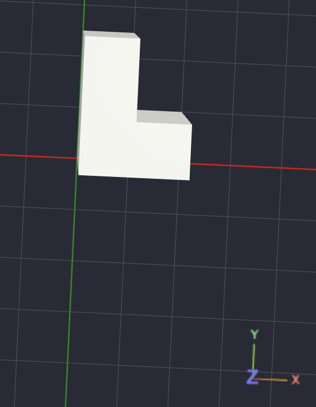
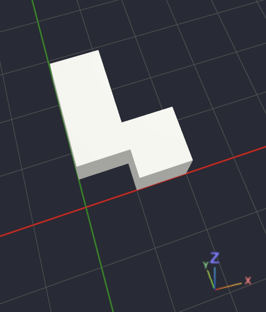
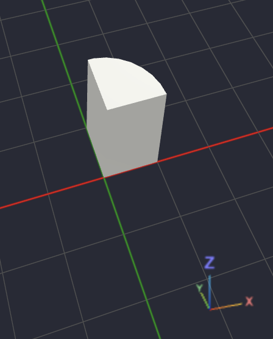
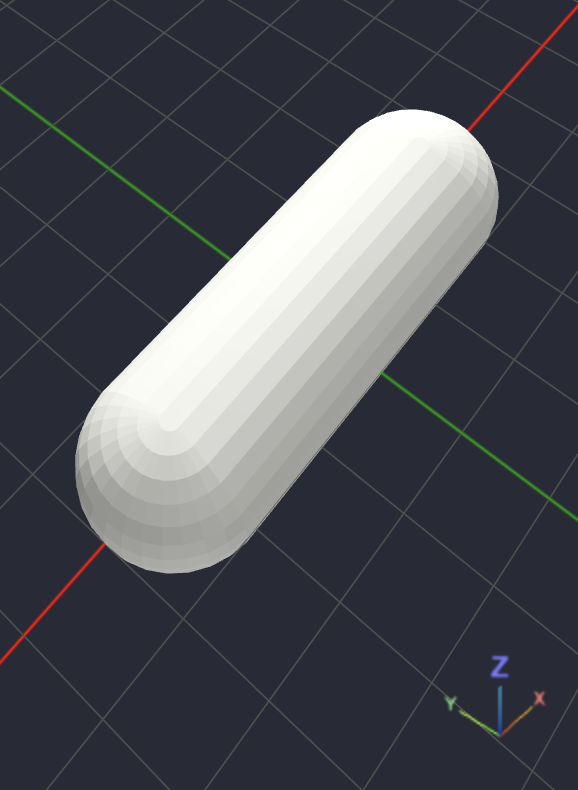
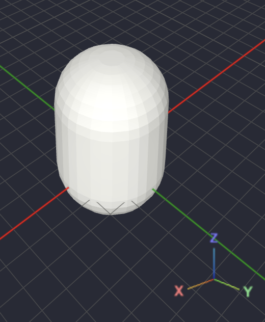
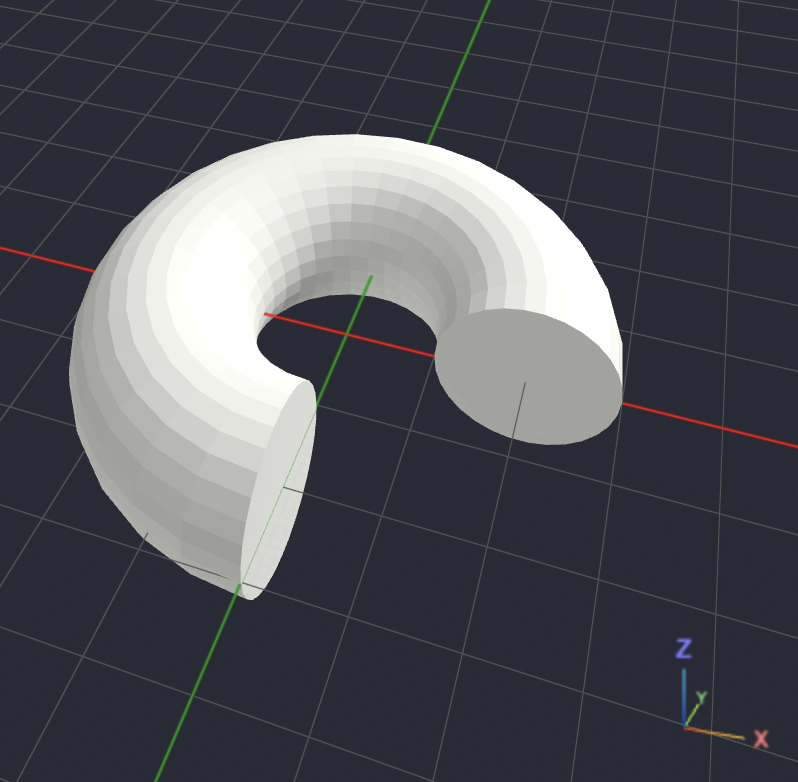

## Operações geométricas

Depois de aprender as primitivas e a linguagem, o próximo assunto mais importante é justamente as operações geométricas. Na prática, é com elas que você constrói praticamente qualquer modelo no OpenSCAD.

Há alguns grupos de operações para trabalhar

1. Operações booleanas - Como os objetos interagem entre si.
2. Transformações - Onde o objeto fica e como ele é orientado.
3. Extrusões - Como transformar um desenho 2D em um sólido 3D.
4. Operações de geometria - Como gerar novas formas a partir das existentes."
5. Operações de importação/projeção - Como trazer geometrias de fora ou converter entre 2D e 3D.

### Union

O Union é uma operação que une dois ou mais solidos em um unico

O exemplo a baixo mostra a união de 2 cubos, resultando em um sólido geometrico no formato de um L

```scad
union(){
    cube([20,10,10]);
    cube([10,25,10]);
}
```

Resultado:

<p align="center">
  
</p>

### Difference

Ao contrário do union ele gera novos solidos removendo um solido do outro, assim como a operação matemática de subtração.

Na operação de diferença o solido que vem primeiro é o principal

O código a seguir realiza a operação de diferença entre o solido formado na operação de união, e um cubo que mede 5mm no eixo y

```scad
module L(){
    union(){
    cube([20,10,10]);
        cube([10,25,10]);
    }
}

difference(){
    L();
    cube([10,5,10]);
}
```

O resultado dessa operação é a seguinte:

<p align="center">
  
</p>

### Interseção

A intersseção mantém apenas a região em comum entre dois ou mais sólidos.

O código a seguir é um exemplo da intercessão entre um circulo e um cubo, ambos centralizados ao centro da malha.

```scad
intersection(){
    cylinder(h=20, r=10);
    cube([20,20,20]);
}
```

o resultado dessa operação é a seguinte:

<p align="center">
  
</p>

### Hull

Essa é uma operação interessante

Ela cria o menor volume capaz de envolver todos os objetos.

```scad
hull(){
    translate([-20,0,0])
        sphere(10);

    translate([20,0,0])
        sphere(10);
}
```

esse código é um exemplo com 2 esferas, o resiltado é o seguinte:

<p align="center">
  
</p>

### Minkowski

É uma operação matemática.

Ela soma a geometria de dois objetos.

```scad
minkowski(){
    sphere(20);
    cylinder(h=30,r=3);
}
```

O resultado dessa operação é o seguinte:

<p align="center">
  
</p>

### Liner extrude

O linear extrude é uma opração que transforme objetos 2d me objetos 3d,
ele já foi mencionado na sessão de [sólidos geométricos](./docs/basic/solids.md)

```scad
linear_extrude(
    height=20
)
    circle(10);
```

muito utilizada com svg

```scad
linear_extrude(5)

import("logo.svg");
```

O linear extrude tem algumas parametros que podem ser utilizados

| Parâmetros  | Descrição                                                                |
| ----------- | ------------------------------------------------------------------------ |
| `height`    | Altura da extrusão no eixo Z.                                            |
| `center`    | Se `true`, centraliza a extrusão no eixo Z. Padrão: `false`.             |
| `twist`     | Gira o perfil 2D entre a base e o topo, em graus. Ex.: `twist=180`.      |
| `slices`    | Número de fatias usadas na torção. Padrão: `20`.                         |
| `scale`     | Escala do topo em relação à base. Padrão: `1`. Ex.: `scale=0.5` afunila. |
| `convexity` | Ajuda o OpenSCAD a renderizar formas complexas. Padrão: `10`.            |

### Rotate extrude

Gira um perfil 2D em torno do eixo Z.

```scad
// girar o objeto 2d em torno do eixo Z
rotate_extrude(
    angle=270,
)

// deslocar o objeto 2d para a direita em 20 unidades
translate([20,0])

// criar um circulo com raio de 10 unidades
circle(r=10);
```

O resultado dessa operação pode ser visto na imagem:

<p align="center">
  
</p>

### Projection

A projeção converte o objeto 3d em um objeto 2d, como se estivesse projetando uma sombra

```scad
projection()

sphere(20);
```

O resultado final é um circulo 2d

### Render

Essa operação força o OpenSCAD a calcular uma geometria antes de continuar.

O comando render() é um dos mais difíceis de entender porque, na maioria dos casos, ele não muda o resultado visual do modelo.

A melhor forma de pensar nele é assim:

| `render()` "congela" a geometria gerada até aquele ponto.

Ou seja, ele pede ao OpenSCAD:

"Pare de manter esse objeto como uma sequência de operações e transforme-o em uma malha definitiva antes de continuar."

```scad
render()
minkowski(){
    sphere(20);
    cylinder(h=30,r=3);
}
```
