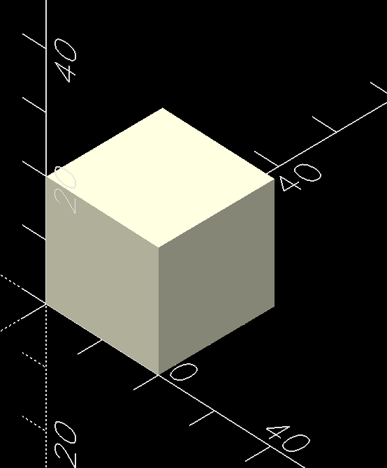

## Polyhedron

O polyhedron() é provavelmente o comando mais poderoso do OpenSCAD, mas também um dos mais difíceis de aprender. Por esse motivo esta sessão foi separada exclusivamente para ele.

### A ideia principal

Imagine um cubo.
Normalmente você faz:

```scad
cube(20);
```

Com `polyhedron()`, você precisa construir esse cubo manualmente.

Primeiro, define todos os vértices.

```
        7 ●────────● 6
         /|       /|
        / |      / |
     4 ●────────●5 |
       |  |     |  |
       |3 ●─────|──●2
       | /      | /
       |/       |/
     0 ●────────●1
```

Cada bolinha possui uma coordenada.

### Pontos

Os points são os vértices.

```scad
points = [

    [0,0,0],      //0
    [20,0,0],     //1
    [20,20,0],    //2
    [0,20,0],     //3

    [0,0,20],     //4
    [20,0,20],    //5
    [20,20,20],   //6
    [0,20,20]     //7

];
```

É exatamente igual ao polygon(), mas agora cada ponto possui:

```
[x,y,z]
```

### Faces

Agora você diz quais pontos formam cada face.

A base:

```
0 → 1 → 2 → 3
```

vira

```
[0,1,2,3]
```

O topo:

```
4 → 5 → 6 → 7
```

vira

```
[4,5,6,7]
```

Uma lateral:

```
0 → 1 → 5 → 4
```

vira

```
[0,1,5,4]
```

### Cubo completo

O código do cubo completo fica assim

```scad
points = [

    [0,0,0],      //0
    [20,0,0],     //1
    [20,20,0],    //2
    [0,20,0],     //3

    [0,0,20],     //4
    [20,0,20],    //5
    [20,20,20],   //6
    [0,20,20]     //7

];

faces=[

    [0,1,2,3],   //baixo
    [4,5,6,7],   //topo

    [0,1,5,4],
    [1,2,6,5],
    [2,3,7,6],
    [3,0,4,7]

];

polyhedron(points, faces);
```

Pronto.

Você criou um cubo sem usar cube().

no final o resultado do código pode ser visto na imagem:

<p align="center">
  
</p>

### Por que fazer isso?

Porque agora você pode criar qualquer formato.

Não existe um comando chamado:

```
diamond();
```

Mas com polyhedron() você consegue criar essa forma.

### Como pensar

Sempre siga este processo:

1. Liste todos os pontos.
2. Pergunte: Quais pontos formam uma face?
