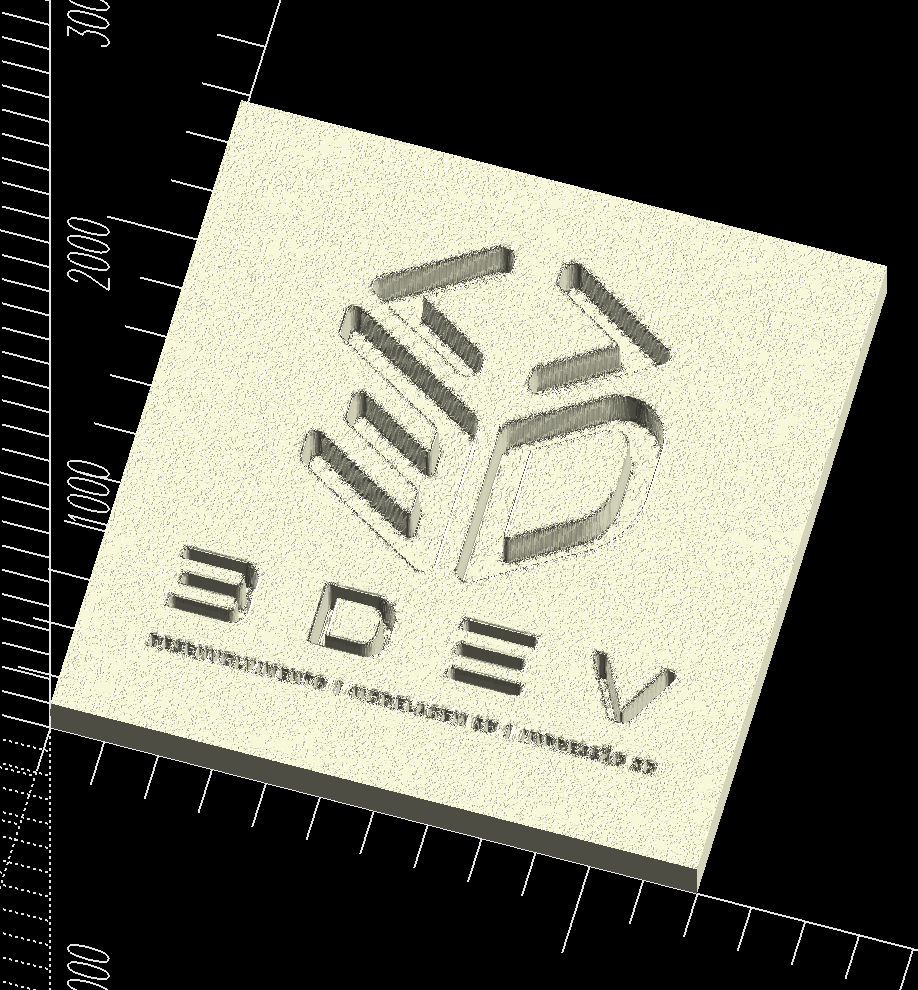

## Surface

O surface é provavelmente o último grande comando nativo do OpenSCAD

Para transformar imagens em modelos 3D, esse comando é especialmente importante.

### O que é o surface?

O surface() cria um modelo 3D a partir de um mapa de altura (heightmap).

Em vez de usar vetores (como SVG), ele usa a intensidade de cada pixel para definir a altura da superfície.

Imagine uma imagem em tons de cinza:

```scad
Preto        Cinza        Branco

███          ▓▓▓          ░░░
```

O OpenSCAD interpreta assim:

```
Preto  → altura baixa

Cinza  → altura média

Branco → altura alta
```

Então uma imagem vira um relevo.

### Como funciona?

Imagine esta imagem:

```scad
⬛⬛⬛⬛⬛
⬛⬜⬜⬜⬛
⬛⬜⬛⬜⬛
⬛⬜⬜⬜⬛
⬛⬛⬛⬛⬛
```

O OpenSCAD gera algo parecido com:

```scad
        ███
      ███████
    ███     ███
      ███████
        ███
```

Cada pixel possui uma altura.

Basicamente os pixels de cores mais escuras vão ter uma altura menor, enquanto os de cores mais claras vão ter uma altura de cor maior, seguindo o esquema de intensidade da cor.

### Exemplo

Abaixo segue o exmeplo do código sendo utilizado para transformar um arquivo de imagem do tipo png em um modelo 3D

```scad
path = "../../../public/3dev.png";

surface(file = path);
```

O resultado desse código está apresentado na imagem a baixo

<p align="center">
  
</p>

parâmetros:

| parametro   | descrição                                                                             | como usar                                                                   |
| ----------- | ------------------------------------------------------------------------------------- | --------------------------------------------------------------------------- |
| `file`      | Caminho do arquivo de heightmap. Aceita `.png` (imagem) ou `.dat` (texto).            | `surface(file = "logo.png")` ou `surface(file = path)` com variável.        |
| `center`    | Centraliza a superfície na origem dos eixos X e Y. Padrão: `false`.                   | `surface(file = path, center = true)` posiciona o modelo no centro.         |
| `invert`    | Inverte a leitura da altura dos pixels. Só funciona com imagens PNG. Padrão: `false`. | `surface(file = path, invert = true)` faz áreas claras ficarem mais baixas. |
| `convexity` | Melhora a renderização no preview de formas complexas. Padrão: `1`.                   | `surface(file = path, convexity = 10)` evita erros visuais no preview.      |

Para controlar a altura final do relevo, use `scale()`:

```scad
scale([1, 1, 0.1])
    surface(file = path, center = true);
```

### O PNG precisa ser especial

Esse é o ponto que mais confunde.

O `surface()` não entende cores.

Ele trabalha apenas com:

- preto
- branco
- tons de cinza

Cada pixel vira uma altura.

Por exemplo:

| Cor          | Altura |
| ------------ | ------ |
| Preto        | 0 mm   |
| Cinza escuro | 2 mm   |
| Cinza        | 5 mm   |
| Cinza claro  | 8 mm   |
| Branco       | 10 mm  |

### PNG colorido

Imagine

```scad
🟦🟨🟥🟩
```

O OpenScad precisa converter isso para:

```scad
▓ ░ █ ▒
```

Depois cria as alturas.

Ou seja:

a informação de cor é perdida.

### O tamanho do modelo

Outro detalhe importante.

Cada pixel vira um quadradinho.

Imagem

```
100 × 100
```

gera

```
100 × 100 vértices
```

Imagem

```
1000 × 1000
```

gera

```
1.000.000 de pontos
```

Isso fica extremamente pesado.

Por isso normalmente reduzimos a imagem antes.

### Quando usar surface()?

Use quando a imagem representa uma altura, por exemplo:

- mapas topográficos;
- relevos de fotos em tons de cinza;
- placas decorativas;
- litofânias (quadros impressos em 3D que revelam a imagem com luz por trás);
- texturas.

Evite surface() para:

- logotipos simples;
- ícones;
- desenhos de corte;
- formas planas.

Nesses casos, um SVG + linear_extrude() produz resultados muito melhores.

### Comparação com SVG

| SVG (`import` + `linear_extrude`)        | `surface()`                              |
| ---------------------------------------- | ---------------------------------------- |
| Vetorial                                 | Raster (pixels)                          |
| Bordas perfeitamente nítidas             | Bordas dependem da resolução da imagem   |
| Ideal para logotipos, textos e contornos | Ideal para relevos e mapas de altura     |
| Fácil de editar e escalar                | Escalar demais pode evidenciar os pixels |
| Gera menos polígonos                     | Pode gerar malhas muito densas           |
